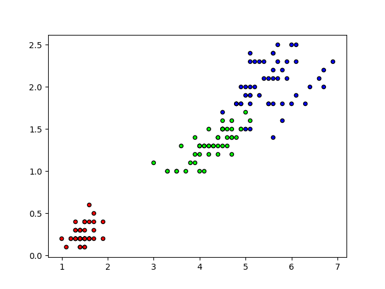

# K-Nearest Neighbors (KNN)

## What is it?
This is an advanced algorithm that falls under the field of data mining and machine learning.
It is a supervised classifier that determines the classification of new data based on its
similarity with existing data.

### Explicit Example
Here is a visual example for better understanding.

## How it works?

The KNN algorithm works using the nearest observable location, which determines the classification of new visible observations. The basic steps that KNN follows are:

1. Select K number of neighbors
2. Calculate the distance (Euclidean, Manhattan, Minkowski or Weighted) from K
3. Find the K nearest neighbors
4. Vote for the prediction

## Benefits
    
- Easy to understand and implement
- Does not assume any probability distributions in the input data. This makes it useful with input data that has an unusual distribution.

## Disadvantages
    
- The KNN algorithm is one of the slowest algorithms as it needs to calculate the distance from each instance to all training instances.
- Does not work well with large-scale data.
- Sensitive to irrelevant data

## Application
    
The KNN algorithm has applications in finance, healthcare, policy research, credit, politics, obesity studies, and more.

## References
- [KNN (K-Nearest Neighbors)](https://medium.com/brasil-ai/knn-k-nearest-neighbors-1-e140c82e9c4e)
- [K-Nearest Neighbors Algorithm (KNN)](https://rodrigomodesto.medium.com/algoritmo-k-nearest-neighbors-knn-uma-abordagem-matem%C3%A1tica-46f59c5c2f99)