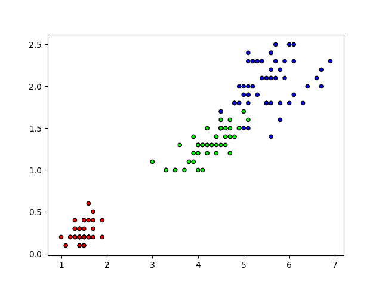

# K-Nearest Neighbors ( KNN )

## O que é?
Este é um algoritmo avançado que se enquadra no campo de mineração de dados e aprendizado de máquina.
É um classificador supervisionado que determina a classificação de novos dados com base em sua
similaridade com dados existentes.

### Exemplo Explícito
Aqui está um exemplo visual para uma melhor compreensão.
  

## Como funciona?

O algoritmo KNN funciona através da localização observável mais próxima, o qual determina a classificação de novas observações visíveis. As etapas básicas que KNN segue são:

1. Selecione o número K de vizinhos
2. Calcule a distância (Euclidiana, Manhattan, Minkowski ou Ponderada ) de K
3. Encontre os K vizinhos mais próximos
4. Vote para a previsão

## Vantagens 
   
- Fácil de entender e implementar
- Não assume nenhuma probabilidade distribuições nos dados de entrada. Isso o torna útil com os dados de entrada que têm uma distribuição incomum.

## Desvantagens
   
- O algoritmo KNN é um dos algoritmos mais lentos, uma vez que ele precisa calcular a distância de cada instância para todas as instâncias de treinamento.
- Não funciona bem com dados em larga escala.
- Sensível a dados irrelevantes

## Aplicação 
   
O algoritmo KNN tem aplicação no setor financeiro, no setor de saúde, na pesquisa política, no crédito, na política, nos estudos de obesidade e muito mais.

## Referências
- [KNN (K-Nearest Neighbors)](https://medium.com/brasil-ai/knn-k-nearest-neighbors-1-e140c82e9c4e)
- [Algoritmo K-Nearest Neighbors (KNN)](https://rodrigomodesto.medium.com/algoritmo-k-nearest-neighbors-knn-uma-abordagem-matem%C3%A1tica-46f59c5c2f99)